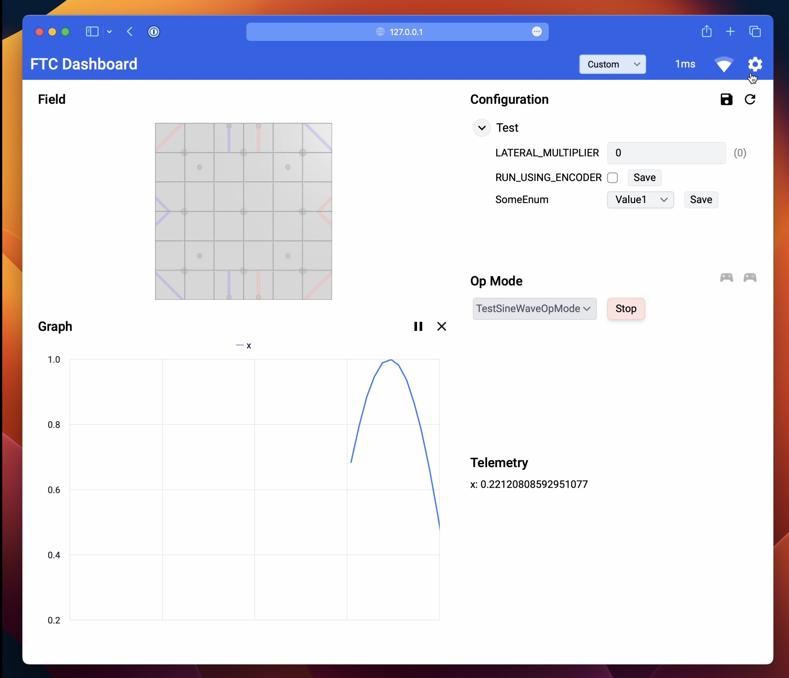

# FTC Dashboard

FTC Dashboard provides telemetry and monitoring tools for FTC robots during operation with the following features:

- Live telemetry with plots and field graphics
- Live configuration variables
- Camera streaming
- Limited op mode controls and gamepad support
  - Note: Gamepad support is volatile due to unstable browser APIs
- Custom dashboard layouts
- Telemetry CSV export

Check out our [online documentation](https://acmerobotics.github.io/ftc-dashboard).

|       Screenshot of custom layout        |          Screenshot with theme           |
| :--------------------------------------: | :--------------------------------------: |
|  |  |

# Installation

## Basic

1. Open [`build.dependencies.gradle`](https://github.com/FIRST-Tech-Challenge/FtcRobotController/blob/master/build.dependencies.gradle)
2. In the `repositories` section, add `maven { url = 'https://maven.brott.dev/' }`
3. In the `dependencies` section, add `implementation 'com.acmerobotics.dashboard:dashboard:0.4.13'`

    Please see [GitHub releases page](https://github.com/acmerobotics/ftc-dashboard/releases) for the latest version number

4. If you’re using OpenRC or have non-standard SDK dependencies, add the following exclusion:

    ```
    implementation('com.acmerobotics.dashboard:dashboard:0.4.13') {
      exclude group: 'org.firstinspires.ftc'
    }
    ```

# Development

## Installation

1. Install Node.js

   - Note: Node.js 16+ is required for builds to work on M1 MacBooks
   - Current Node version used in gradle builds can be found in [FtcDashboard/build.gradle](https://github.com/acmerobotics/ftc-dashboard/blob/8ac8b29257dede5f4a13c440fe6756efc270cbb8/FtcDashboard/build.gradle#L4)
   - Node version is `18.12.1` as of time of writing

2. Install Yarn

   - Not explicitly required and provides little advantage over modern `npm` (as of the time of writing)
   - Further instructions will however reference `yarn` over `npm` for historical reasons

3. Browser FTC Dashboard client is located in `FtcDashboard/dash`

4. Run `yarn` (alternatively `npm install`) to install dependencies

   - This only need be done once

5. Optionally, specify the server IP address through the environment variable `VITE_REACT_APP_HOST`

   - Details on Vite's environment variables can be found [here](https://vitejs.dev/guide/env-and-mode.html)

   - Default IPs:
     - Android Phone: `192.168.49.1`
     - Control Hub: `192.168.43.1`

6. Run `yarn dev` (alternatively `npm run dev`) to start the development server

   - This will start a development server on [`http://localhost:3000`](http://localhost:3000) by default
   - Navigate to this address in your browser to view the dashboard client
   - The development server will automatically reload when changes are made to the source code

## Mock server

To test without an FTC app, run the mock server located at `DashboardCore/src/test/java/com/acmerobotics/dashboard/TestServer.java`.

- Mock server is a simple Java server hosting mock FTC op modes
- A test sample op mode can be found at [`TestSineWaveOpMode.java`](https://github.com/acmerobotics/ftc-dashboard/blob/master/DashboardCore/src/test/java/com/acmerobotics/dashboard/TestSineWaveOpMode.java)
- Test op modes are registered in [`TestOpModeManager.java`](https://github.com/acmerobotics/ftc-dashboard/blob/8ac8b29257dede5f4a13c440fe6756efc270cbb8/DashboardCore/src/test/java/com/acmerobotics/dashboard/testopmode/TestOpModeManager.java#L10)

# Basic Architecture

## Java Server

Dashboard's server is split into two packages, `DashboardCore` and `FtcDashboard`

- [Dashboard Core](https://github.com/acmerobotics/ftc-dashboard/tree/master/DashboardCore/src/main/java/com/acmerobotics/dashboard)
  - A standalone library that can be used to create a dashboard server for any Java application
- [FtcDashboard](https://github.com/acmerobotics/ftc-dashboard/tree/master/FtcDashboard/src/main/java/com/acmerobotics/dashboard)
  - A wrapper around `DashboardCore` that provides relevant tooling and hooks for FTC teams
  - Contains the API FTC teams will access and manipulate through their own code
  - This package also contains the browser client source

## Browser Client

Primary interface as a web-client acessible to the end-user through a web browser

- Located in [`FtcDashboard/dash`](https://github.com/acmerobotics/ftc-dashboard/tree/master/FtcDashboard/dash)
- Installation and run instructions mentioned above
- TypeScript + React application
- Vite for builds
- Web Socket connection to the dashboard server

### Relevant files

- [Dashboard.tsx](https://github.com/acmerobotics/ftc-dashboard/blob/master/FtcDashboard/dash/src/components/Dashboard/Dashboard.tsx)
  - Primary functional entrypoint
- [LayoutPreset.tsx](https://github.com/acmerobotics/ftc-dashboard/blob/master/FtcDashboard/dash/src/enums/LayoutPreset.tsx)
  - Contains preset layouts
- [`views/`](https://github.com/acmerobotics/ftc-dashboard/tree/master/FtcDashboard/dash/src/components/views)
  - Contains the various views that can be displayed on the dashboard
    - Graphs
    - Telemetry
    - Gamepad
    - etc
- [`store/`](https://github.com/acmerobotics/ftc-dashboard/tree/master/FtcDashboard/dash/src/store)
  - Contains shared state management logic
    - Web Socket connection
    - Gamepad state management
    - Storage middleware
    - etc
- Views subscribe to websocket updates via the Redux store
  - Basic example can be found in the [`TelemetryView`](https://github.com/acmerobotics/ftc-dashboard/blob/8ac8b29257dede5f4a13c440fe6756efc270cbb8/FtcDashboard/dash/src/components/views/TelemetryView.tsx#L21) component
